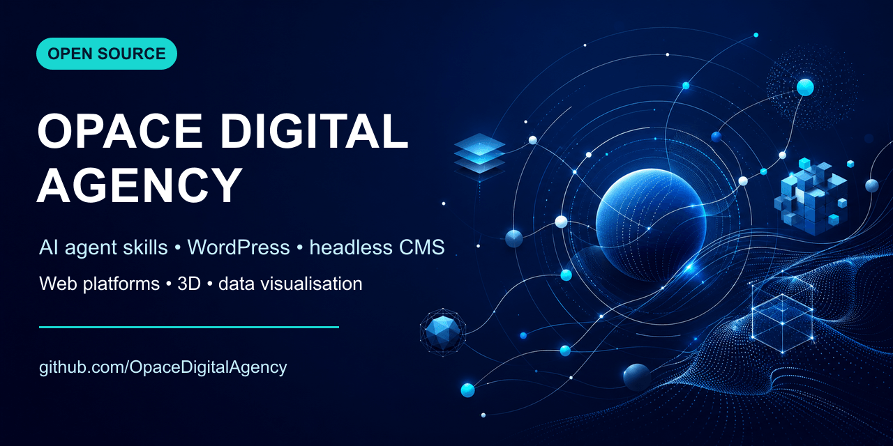

# Opace Digital Agency Open Source

**AI Agent Skills, WordPress plugins, headless platforms and interactive web applications from [Opace Digital Agency](https://opace.agency), Birmingham, UK.**

This repository is the canonical index of Opace open-source projects. Start with the Agent Skills below, or browse the portfolio by area.

## AI Agent Skills

| Project                                                                                    | What it provides                                                                                                                                                                                                                                       |
| ------------------------------------------------------------------------------------------ | ------------------------------------------------------------------------------------------------------------------------------------------------------------------------------------------------------------------------------------------------------ |
| **[AI UI/UX Motion Engine](https://github.com/OpaceDigitalAgency/ai-ui-ux-motion-engine)** | Production Agent Skill and plugin for AI website design, UI/UX, frontend development, motion graphics, cinematic scroll experiences, Three.js and accessible interaction across Codex, Claude Code, Cursor, Copilot, Antigravity, Gemini and Windsurf. |
| **[Opace Agent Skills](https://github.com/OpaceDigitalAgency/skills)**                     | The wider open collection and catalogue of reusable AI Agent Skills, installers, platform guidance and releases.                                                                                                                                       |

## AI and WordPress

| Project                                                                                   | What it provides                                                                          |
| ----------------------------------------------------------------------------------------- | ----------------------------------------------------------------------------------------- |
| **[AI Core](https://github.com/OpaceDigitalAgency/ai-core-integration-hub-prompt-engine-wordpress-plugin)** | Shared WordPress AI infrastructure for provider credentials, live models, prompts, normalised requests and usage records. Version 1.0 is the first public release. |
| **[AI Scribe](https://github.com/OpaceDigitalAgency/ai-scribe-chat-gpt-content-creator)** | Guided WordPress content and SEO workflow. Its version 3 architecture uses AI-Core for the shared provider layer.                                            |
| **[Article Smasher](https://github.com/OpaceDigitalAgency/article-smasher)**              | AI-powered content generation, repurposing and content-marketing utility.                 |

## Web platforms and productivity tools

| Project                                                                                  | What it provides                                                                                                                                                                                                             |
| ---------------------------------------------------------------------------------------- | ---------------------------------------------------------------------------------------------------------------------------------------------------------------------------------------------------------------------------- |
| **[Astro Visual Editor](https://github.com/OpaceDigitalAgency/astro-visual-editor)**     | Development-only Astro integration for front-end text and SEO editing, drag-and-drop sections, reviewed change queues and validated source writes. [View the product page](https://opace.agency/tools/astro/visual-editor/). |
| **[Headless CMS](https://github.com/OpaceDigitalAgency/headless-cms)**                   | Productised Payload CMS platform with reusable content blocks, PostgreSQL, Next.js and Astro frontends.                                                                                                                      |
| **[Opace Annotate](https://github.com/OpaceDigitalAgency/website-critique-tool)**        | Visual website-review and design-feedback application for HTML mockups and live sites.                                                                                                                                       |
| **[SmashingApps](https://github.com/OpaceDigitalAgency/smashingapps-unified)**           | React application combining AI productivity tools including Task Smasher and Article Smasher.                                                                                                                                |
| **[Task Smasher](https://github.com/OpaceDigitalAgency/task-smasher)**                   | Secure, rate-limited OpenAI API proxy using Netlify serverless functions.                                                                                                                                                    |
| **[Driving Lesson Hunter](https://github.com/OpaceDigitalAgency/driving-lesson-hunter)** | UK driving-test-centre finder using geocoding and official public data.                                                                                                                                                      |
| **[Evolution of Religion Timeline](https://github.com/OpaceDigitalAgency/timelinev2)**   | Interactive data visualisation covering the development and spread of world religions.                                                                                                                                       |
| **[Next.js Starter](https://github.com/OpaceDigitalAgency/becks)**                       | Lightweight starter for modern JavaScript web applications.                                                                                                                                                                  |

## 3D and interactive web projects

| Project                                                                  | What it provides                                                                  |
| ------------------------------------------------------------------------ | --------------------------------------------------------------------------------- |
| **[3D Racing](https://github.com/OpaceDigitalAgency/3D-Racing)**         | Browser-based 3D racing prototype using Babylon.js, TypeScript, WebGL and WebGPU. |
| **[Neon Dusk Circuit](https://github.com/OpaceDigitalAgency/new-racer)** | Browser-playable Babylon.js racing experience with advanced rendering.            |
| **[Roomba](https://github.com/OpaceDigitalAgency/Roomba)**               | Interactive 3D visualisation built with React Three Fiber and Three.js.           |

## Technologies and areas

AI Agent Skills · Codex skills · Claude Code skills · GitHub Copilot · OpenAI · Astro integration · visual editing · frontend editing · WordPress plugins · headless CMS · Payload CMS · frontend development · content creation · web design · 3D visualisation · data visualisation · accessibility-aware motion

## Agency services

- [Web design and development](https://opace.agency/services/web-design/)
- [Astro development](https://opace.agency/services/web-design/astro-development/)
- [Next.js and React development](https://opace.agency/services/web-design/next-js-react-development)
- [WordPress development](https://opace.agency/services/web-design/wordpress-development/)
- [AI SEO](https://opace.agency/services/ai-seo/)
- [Pay-monthly websites](https://monthlywebdesign.com)

## About Opace

Opace is a Birmingham digital agency specialising in open-source development, WordPress, e-commerce, headless platforms, AI integrations and modern web applications.

- [Opace website](https://opace.agency)
- [LinkedIn](https://www.linkedin.com/company/opace/)
- [Facebook](https://www.facebook.com/opacewebdesign)
- [X / Twitter](https://twitter.com/OpaceWeb)
- [Instagram](https://www.instagram.com/opacedigital)

---

**[Browse this canonical Opace open-source portfolio repository](https://github.com/OpaceDigitalAgency/OpaceDigitalAgency)** · **[View the Opace GitHub profile](https://github.com/OpaceDigitalAgency)**
